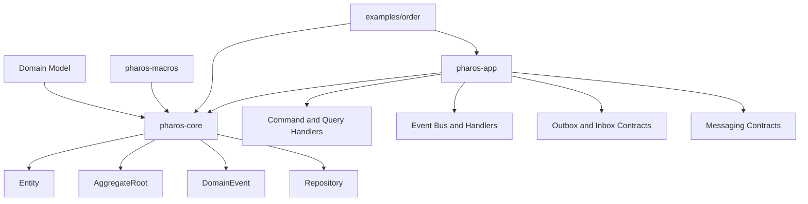

# Pharos RS


Pharos RS is a lightweight Rust framework for building domain-driven, CQRS-friendly, event-driven applications.

The public API is intentionally small: a domain core, an application-contract crate, and a convenience facade that reexports the stable surface so users can get started quickly without learning every crate at once.

## Highlights

- Domain modeling primitives: `Entity`, `AggregateRoot`, `ValueObject`, `DomainEvent`
- Validated value objects via `value_object!`; strongly typed UUID v7 IDs via `id_type!`
- `Money`/`Currency` in `i128` minor units — checked arithmetic, lossless allocation, crypto magnitudes (wei) included
- Command/query handlers with validation + tracing applied by the `dispatch` seam
- Repository abstraction with optimistic concurrency control
- Atomic aggregate save + outbox in one transaction (`TransactionalRepository` / `save_and_enqueue_in`)
- In-process domain event bus with configurable error policy, retry, and dead-letter decorators
- Integration event envelope with typed correlation/causation, tenant, trace and schema metadata
- Schema evolution through JSON upcasters (`VersionedJsonCodec`)
- Outbox dispatcher with per-key ordered concurrency and a failed→DLQ sweep
- Idempotent consumers in one call (`process_idempotent`)
- Durable event sourcing and sagas on PostgreSQL (`PgEventStore`, `PgSnapshotStore`, `PgSagaStore`)
- Saga deadlines: schedule timeouts on `Start`/`Advance` and sweep them with `SagaRunner::run_due_timeouts`
- Tower as the cross-cutting pipeline seam (timeouts, limits, authorization)
- Observability with `tracing` spans and `metrics` counters throughout

## Crate Guide

| Crate | Purpose |
| ----- | ------- |
| `pharos-core` | Domain primitives: entities, aggregates, repositories, value objects, and domain events |
| `pharos-app` | Application contracts: command/query handlers, event bus, integration events, upcasters |
| `pharos-messaging` | Broker-facing contracts: messages, publishers/consumers, retry, outbox/inbox, DLQ |
| `pharos-macros` | Derive macros and `id_type!` for reducing boilerplate |
| `pharos` | Convenience facade that reexports the stable API and prelude |

## Architecture at a glance



## Workspace layout

```text
pharos-rs/
├── crates/
│   ├── pharos-core      # domain primitives
│   ├── pharos-macros    # derive macros + id_type!
│   ├── pharos-messaging # broker contracts, retry, outbox/inbox, DLQ, consumer groups
│   ├── pharos-app       # CQRS, EventBus, integration events, upcasters, Tower adapters
│   ├── pharos-memory    # in-memory adapters for tests and local development
│   ├── pharos-postgres  # pooled PostgreSQL adapters
│   ├── pharos-redis     # Redis messaging adapter
│   ├── pharos-axum      # Axum extractors/helpers for handlers
│   ├── pharos-saga      # saga/process-manager primitives
│   ├── pharos-es        # event sourcing primitives
│   ├── pharos-kafka     # Kafka + schema registry adapters
│   ├── pharos-nats      # NATS messaging adapters
│   ├── pharos-proto     # Protobuf binary serialization for integration events
│   ├── pharos-testing   # EventCapture and test helpers
│   └── pharos           # convenience meta-crate (re-exports + prelude)
├── examples/
│   ├── order
│   ├── multi-tenant
│   └── modular-monolith
└── tools/
    └── pharos-init      # interactive project scaffolder
```

## Getting started

### Scaffold a new project with `pharos-init`

`pharos-init` is an interactive CLI that asks three high-level questions about your system and scaffolds the right project structure automatically — no Docker, Redis, or PostgreSQL knowledge required up front.

```sh
cargo install --path tools/pharos-init
pharos-init
```

You will be asked:

1. **What kind of system?** — single service, modular monolith, event-driven, or high-throughput pipeline
2. **How does it receive work?** — HTTP API or background worker
3. **Does it need to persist state?** — in-memory or durable storage (skipped for event-driven/high-throughput)

From those answers `pharos-init` derives persistence, event delivery, broker, serialization format, and HTTP layer automatically, and generates a ready-to-build project.

### Manual setup

Most applications should start with the `pharos` facade and import from its prelude:

```toml
pharos = { package = "pharos-rs", version = "0.1", features = ["macros"] }
```

```rust
use pharos::prelude::*;
```

If you want lower-level control, depend on `pharos-core`, `pharos-app`, or `pharos-macros` directly.

### Feature flags

| Feature (crate)                | Default | Enables                                                        |
| ------------------------------ | ------- | -------------------------------------------------------------- |
| `macros` (`pharos`)            | yes     | `#[derive(...)]` and `id_type!` (`pharos-macros`)              |
| `tower` (`pharos-app`)         | no      | `CommandHandlerService`/`QueryHandlerService` (pipeline seam)  |
| `retry` (`pharos-app`)         | no      | `Retrying` event-handler decorator (Tokio timer)               |
| `tenant-task-local` (`pharos-app`) | no  | `CURRENT_TENANT` task-local (explicit `TenantContext` is canonical) |

## Documentation

- [Documentation index](docs/README.md)
- [30-minute tutorial](docs/guide/30-minutes.md)
- [Complete usage guide](docs/guide/complete-usage.md)
- [Architecture guide](docs/guide/architecture.md) — event-driven model, outbox, inbox, patterns
- [Crate reference](docs/guide/crates.md) — per-crate API tables
- [Production operations](docs/guide/production.md)
- [Observability setup](docs/guide/observability.md)
- [Decision matrix](docs/guide/decision-matrix.md)
- [Cookbook](docs/guide/cookbook.md)
- [Pitfalls](docs/guide/pitfalls.md)

## Examples

| Example                     | Shows                                                                                              |
| --------------------------- | -------------------------------------------------------------------------------------------------- |
| `examples/order`            | Canonical DDD/CQRS/outbox suite — run with `cargo run -p order`                                    |
| `examples/multi-tenant`     | `TenantContext` + per-tenant repositories and row-level isolation — `cargo run -p multi-tenant`    |
| `examples/modular-monolith` | Two bounded contexts in one process via the in-process event bus — `cargo run -p modular-monolith` |

## Commands

```sh
# build
cargo build --workspace

# test (requires Docker for container-backed integration tests)
cargo test --workspace --all-features
cargo test-docker   # = cargo test --workspace --all-features -- --test-threads=1

# docs
cargo docs   # alias for: cargo doc --workspace --no-deps
```

## Design principles

- Explicit rather than magical
- Framework-light
- Idiomatic Rust
- Compatible with DDD and CQRS patterns
- Extensible through traits and adapters
- Useful for modular monoliths and as a foundation for distributed event-driven systems

## Acknowledgements

Pharos RS stands on top of the Rust ecosystem. Thanks to the maintainers and contributors of these third-party libraries used directly across this workspace:

- [async-nats](https://crates.io/crates/async-nats)
- [axum](https://crates.io/crates/axum)
- [chrono](https://crates.io/crates/chrono)
- [console](https://crates.io/crates/console)
- [criterion](https://crates.io/crates/criterion)
- [dashmap](https://crates.io/crates/dashmap)
- [dialoguer](https://crates.io/crates/dialoguer)
- [futures](https://crates.io/crates/futures)
- [garde](https://crates.io/crates/garde)
- [http](https://crates.io/crates/http)
- [indoc](https://crates.io/crates/indoc)
- [metrics](https://crates.io/crates/metrics)
- [proc-macro2](https://crates.io/crates/proc-macro2)
- [prost](https://crates.io/crates/prost)
- [quote](https://crates.io/crates/quote)
- [rdkafka](https://crates.io/crates/rdkafka)
- [redis](https://crates.io/crates/redis)
- [reqwest](https://crates.io/crates/reqwest)
- [serde](https://crates.io/crates/serde)
- [serde_json](https://crates.io/crates/serde_json)
- [sqlx](https://crates.io/crates/sqlx)
- [syn](https://crates.io/crates/syn)
- [testcontainers](https://crates.io/crates/testcontainers)
- [thiserror](https://crates.io/crates/thiserror)
- [tokio](https://crates.io/crates/tokio)
- [tower](https://crates.io/crates/tower)
- [tracing](https://crates.io/crates/tracing)
- [tracing-subscriber](https://crates.io/crates/tracing-subscriber)
- [uuid](https://crates.io/crates/uuid)

## License

Licensed under either of [Apache License, Version 2.0](LICENSE-APACHE) or [MIT license](LICENSE-MIT) at your option.
