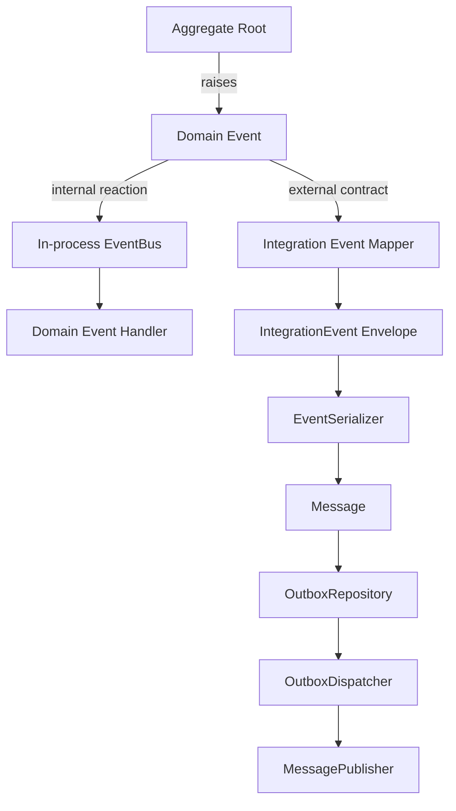
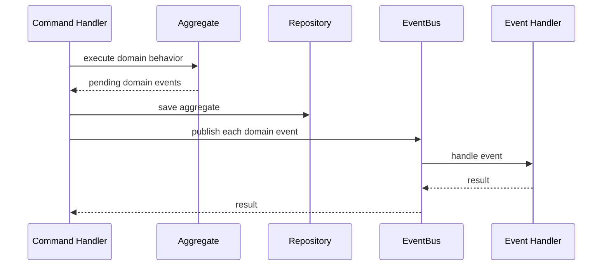
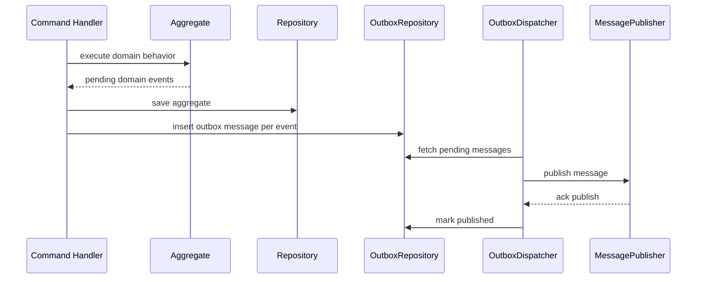
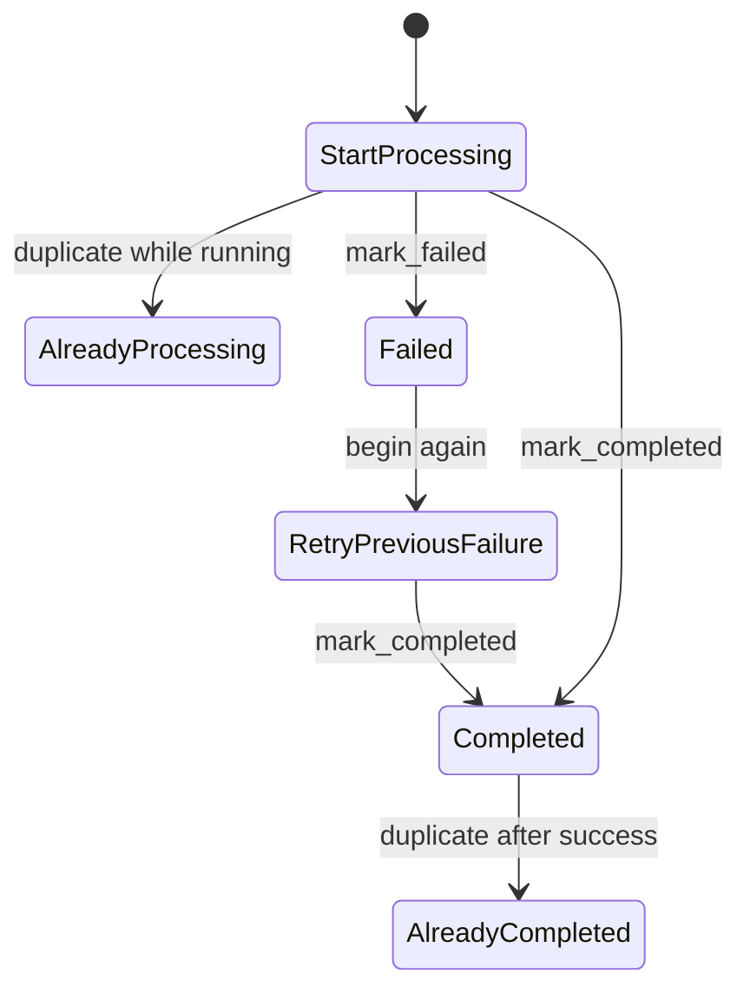
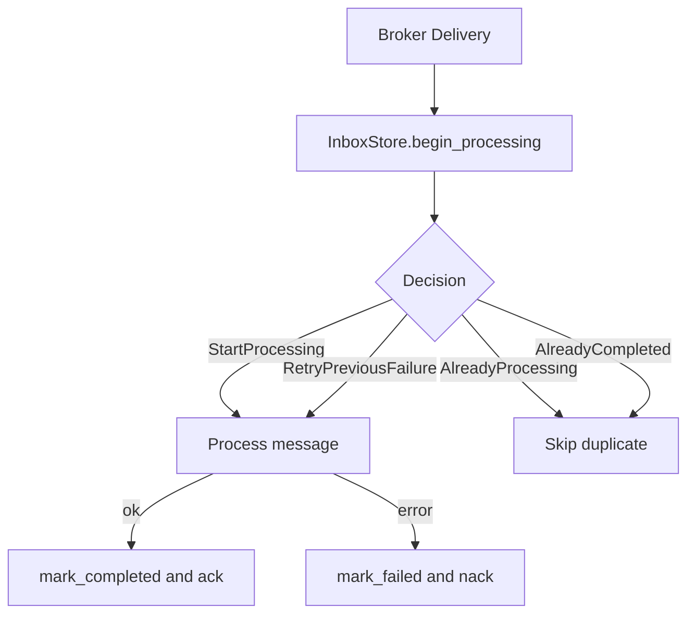
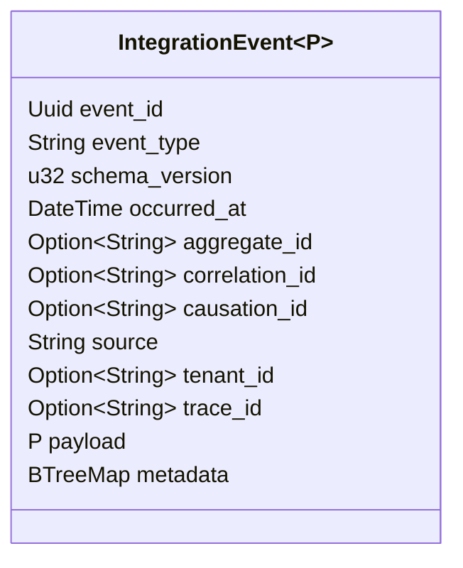
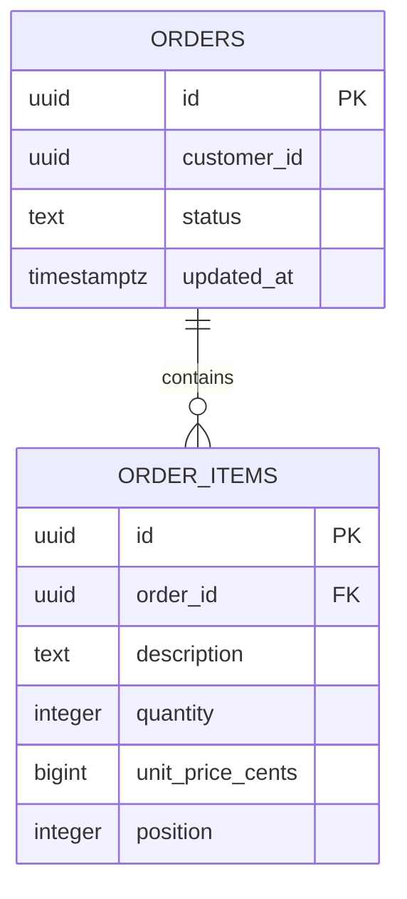
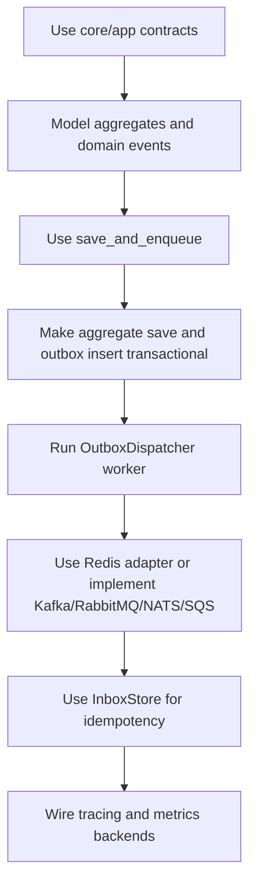

# Architecture guide

This page describes Pharos RS's event-driven architecture and the key patterns
for connecting domain models to external infrastructure.

## Event-driven model

Pharos separates domain events from integration events.

- **Domain events** are internal facts emitted by aggregates.
- **Integration events** are external contracts intended for brokers, other services, pipelines, or async workers.

## Save and publish: in-process domain events

Use `save_and_publish` when your side effects run inside the same process.

This is best for:

- modular monoliths
- local side effects
- tests and examples
- simple event-driven flows inside one process

## Save and enqueue: distributed event-driven seam

Use `save_and_enqueue` when domain events should become durable outbox messages
before being published to external infrastructure.

In production, the aggregate save and outbox insert should usually participate
in the same database transaction. Pharos exposes the seam; concrete transactional
composition belongs to the application or a database-specific adapter (see
`save_aggregate_and_enqueue` in `pharos-postgres`).

## Inbox and idempotent consumers

Consumers in distributed systems must tolerate duplicate deliveries. `InboxStore`
models that behavior.

Typical consumer flow:

## Integration event envelope

`IntegrationEvent
` provides a stable external envelope:

Recommended usage:

- `event_type`: stable routing name, e.g. `OrderConfirmed`
- `schema_version`: increment when the public payload contract changes
- `correlation_id`: business flow identifier
- `causation_id`: command/message/event that caused this event
- `trace_id`: distributed trace propagation
- `source`: service or bounded context emitting the event

## Relational persistence pattern

Pharos intentionally does not try to become an ORM. For relational models, the
recommended pattern is to implement `Repository<A>` explicitly for each aggregate
using SQL that matches the real schema.

The order example includes `PostgresOrderRepository`, which persists the aggregate
in normalized tables:

This repository:

- stores `Order` state in `orders`
- stores aggregate-internal `OrderItem`s in `order_items`
- uses PostgreSQL constraints and a foreign key
- wraps `save` and `delete` in real PostgreSQL transactions
- rehydrates the aggregate through a controlled domain constructor
- is validated by a Docker integration test against PostgreSQL

This is the preferred production direction for relational persistence: explicit
repositories and migrations per aggregate, with framework traits providing the
boundary.

## Recommended production path

See [`production.md`](production.md) for the full deployment checklist.

## Current status and limitations

| Area                        | Current status                                                                                                | Remaining limitation                                                     |
| --------------------------- | ------------------------------------------------------------------------------------------------------------- | ------------------------------------------------------------------------ |
| Specialized broker adapters | Generic messaging traits plus Redis adapter exist                                                             | No first-party Kafka, RabbitMQ, NATS or SQS client adapters yet          |
| Aggregate persistence       | PostgreSQL JSONB repository, tenant-scoped repository, and explicit normalized order repository example exist | No custom relational aggregate repositories generated automatically      |
| Transactions                | `PostgresUnitOfWork` and atomic `save_aggregate_and_enqueue` exist                                            | No higher-level transactional pipeline wrapping command handlers yet     |
| OpenTelemetry               | Configuration descriptor exists                                                                               | No built-in OTLP pipeline installer/exporter dependency wired by default |
| Metrics                     | Metrics config descriptor and counters exist                                                                  | No built-in Prometheus server/exporter dependency wired by default       |
| Transport                   | HTTP/gRPC contracts exist                                                                                     | No Axum/Tonic server adapters yet                                        |
| Schema registry             | Contract and in-memory registry exist                                                                         | No Confluent/Apicurio/remote registry adapter yet                        |
| Dead-lettering              | Contract and in-memory queue exist                                                                            | No PostgreSQL/Redis/broker-backed DLQ adapter yet                        |
| Consumer groups             | Contract and in-memory coordinator exist                                                                      | No broker-native group coordination adapters yet                         |

The framework exposes the seams and default local/PostgreSQL/Redis implementations.
Specialized production adapters for specific ecosystems should be added as separate
infrastructure modules or crates.
