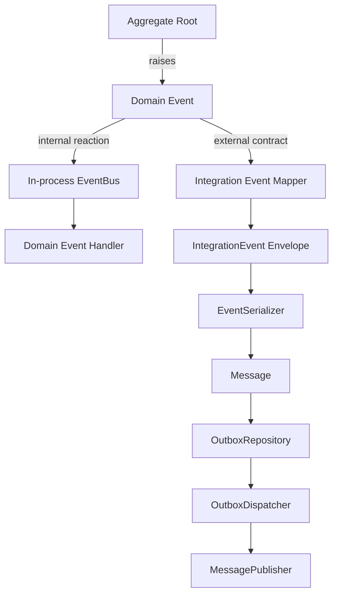
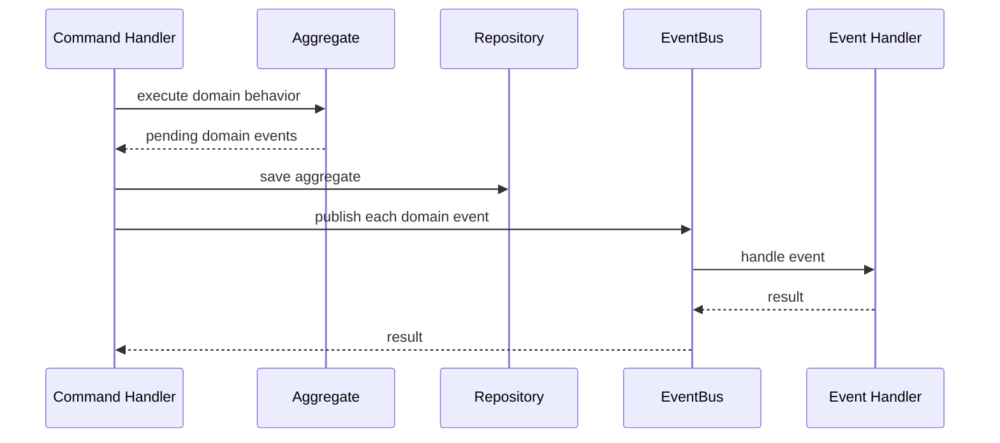
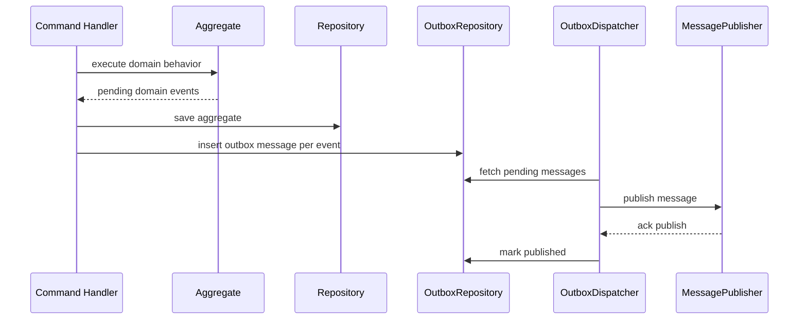
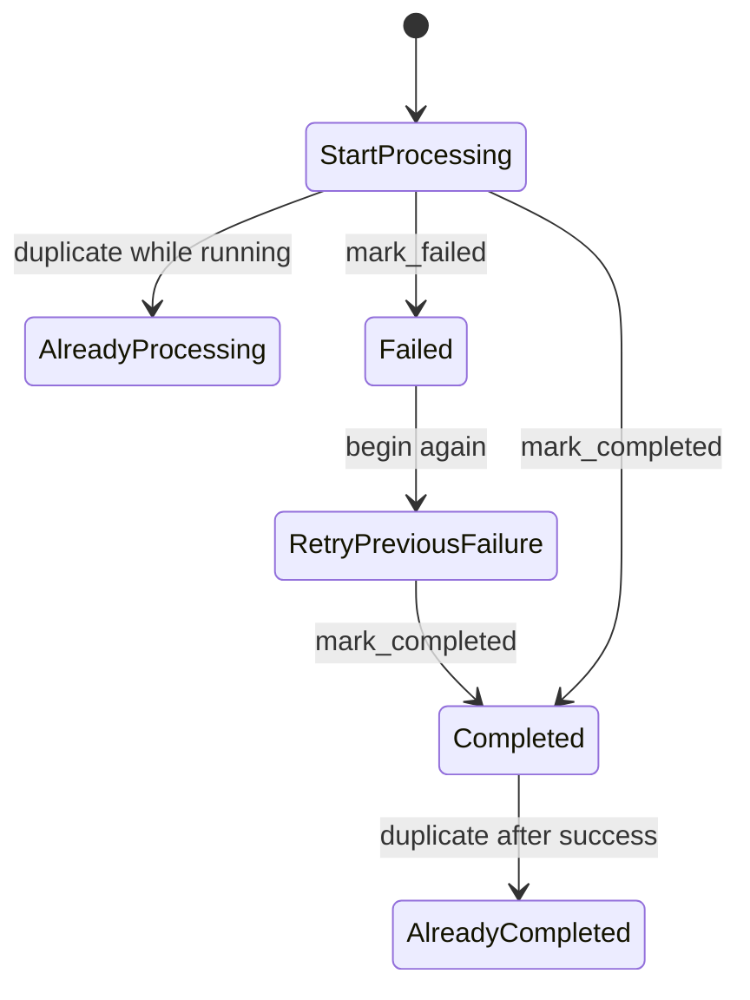
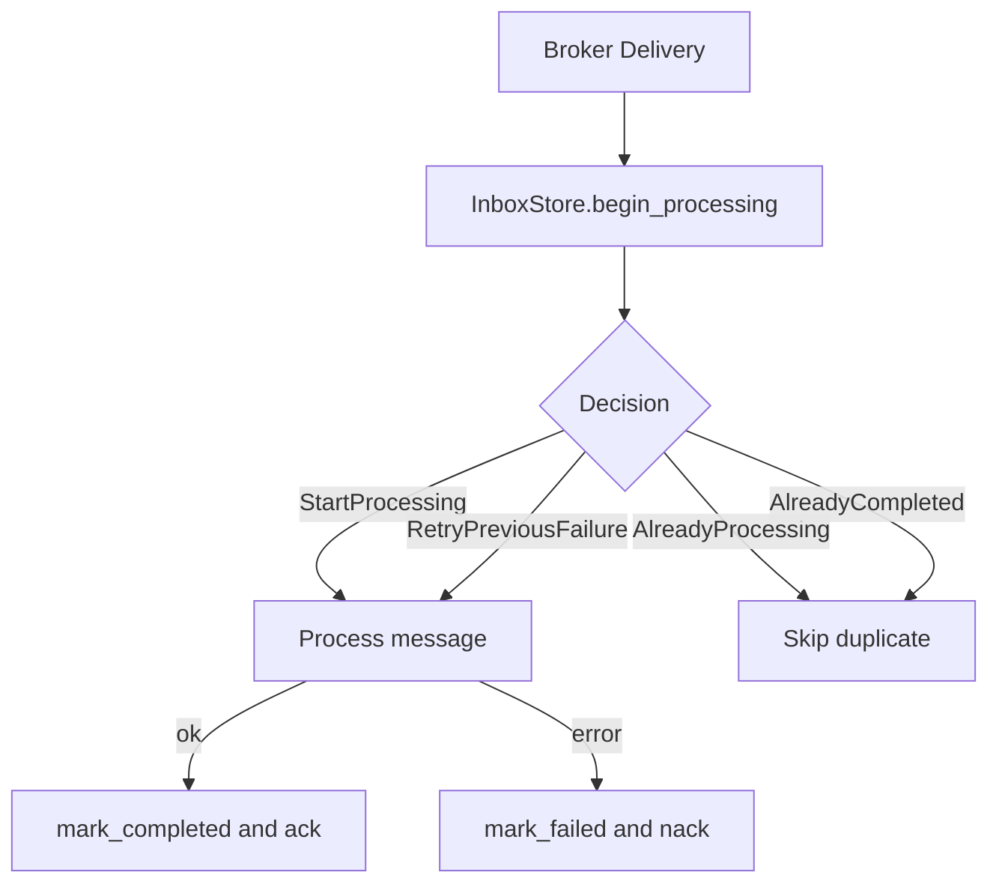
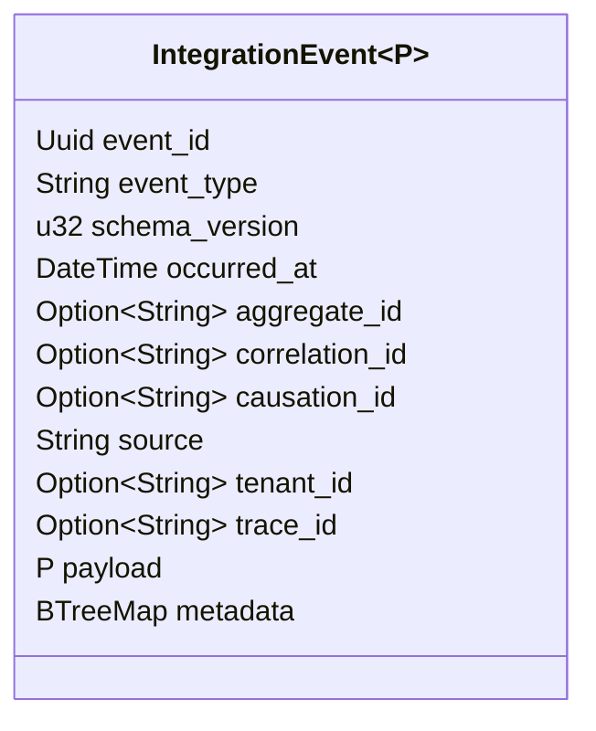
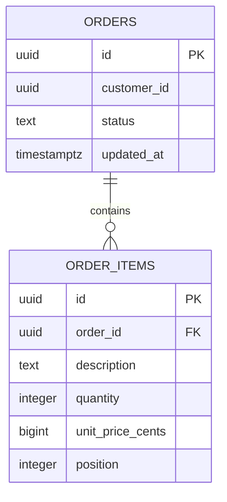
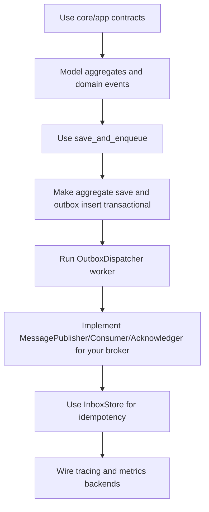

# Architecture guide

This page describes Pharos RS's event-driven architecture and the key patterns
for connecting domain models to external infrastructure.

## Event-driven model

Pharos separates domain events from integration events.

- **Domain events** are internal facts emitted by aggregates.
- **Integration events** are external contracts intended for brokers, other services, pipelines, or async workers.

```mermaid
flowchart TD
    Aggregate[Aggregate Root]
    DomainEvent[Domain Event]
    InternalBus[In-process EventBus]
    Handler[Domain Event Handler]
    Mapper[Integration Event Mapper]
    Envelope[IntegrationEvent Envelope]
    Serializer[EventSerializer]
    Message[Message]
    Outbox[OutboxRepository]
    Dispatcher[OutboxDispatcher]
    Broker[MessagePublisher]

    Aggregate -->|raises| DomainEvent
    DomainEvent -->|internal reaction| InternalBus
    InternalBus --> Handler
    DomainEvent -->|external contract| Mapper
    Mapper --> Envelope
    Envelope --> Serializer
    Serializer --> Message
    Message --> Outbox
    Outbox --> Dispatcher
    Dispatcher --> Broker
```

## Save and publish: in-process domain events

Use `save_and_publish` when your side effects run inside the same process.

```mermaid
sequenceDiagram
    participant UseCase as Command Handler
    participant Aggregate as Aggregate
    participant Repo as Repository
    participant Bus as EventBus
    participant Handler as Event Handler

    UseCase->>Aggregate: execute domain behavior
    Aggregate-->>UseCase: pending domain events
    UseCase->>Repo: save aggregate
    UseCase->>Bus: publish each domain event
    Bus->>Handler: handle event
    Handler-->>Bus: result
    Bus-->>UseCase: result
```

This is best for:

- modular monoliths
- local side effects
- tests and examples
- simple event-driven flows inside one process

## Save and enqueue: distributed event-driven seam

Use `save_and_enqueue` when domain events should become durable outbox messages
before being published to external infrastructure.

```mermaid
sequenceDiagram
    participant UseCase as Command Handler
    participant Aggregate as Aggregate
    participant Repo as Repository
    participant Outbox as OutboxRepository
    participant Worker as OutboxDispatcher
    participant Broker as MessagePublisher

    UseCase->>Aggregate: execute domain behavior
    Aggregate-->>UseCase: pending domain events
    UseCase->>Repo: save aggregate
    UseCase->>Outbox: insert outbox message per event
    Worker->>Outbox: fetch pending messages
    Worker->>Broker: publish message
    Broker-->>Worker: ack publish
    Worker->>Outbox: mark published
```

In production, the aggregate save and outbox insert should usually participate
in the same database transaction. Pharos exposes the seam (`TransactionalStore`
+ `TransactionalRepository` + `save_and_enqueue_in`, all backend-agnostic);
the concrete transactional adapter is yours to implement — see
[Writing an adapter](writing-an-adapter.md).

## Inbox and idempotent consumers

Consumers in distributed systems must tolerate duplicate deliveries. `InboxStore`
models that behavior.

```mermaid
stateDiagram-v2
    [*] --> StartProcessing
    StartProcessing --> AlreadyProcessing: duplicate while running
    StartProcessing --> Failed: mark_failed
    Failed --> RetryPreviousFailure: begin again
    RetryPreviousFailure --> Completed: mark_completed
    StartProcessing --> Completed: mark_completed
    Completed --> AlreadyCompleted: duplicate after success
```

Typical consumer flow:

```mermaid
flowchart TD
    Delivery[Broker Delivery]
    Begin[InboxStore.begin_processing]
    Decision{Decision}
    Work[Process message]
    Complete[mark_completed and ack]
    Fail[mark_failed and nack]
    Skip[Skip duplicate]

    Delivery --> Begin
    Begin --> Decision
    Decision -->|StartProcessing| Work
    Decision -->|RetryPreviousFailure| Work
    Decision -->|AlreadyProcessing| Skip
    Decision -->|AlreadyCompleted| Skip
    Work -->|ok| Complete
    Work -->|error| Fail
```

## Integration event envelope

`IntegrationEvent
` provides a stable external envelope:

```mermaid
classDiagram
    class IntegrationEvent~P~ {
        Uuid event_id
        String event_type
        u32 schema_version
        DateTime occurred_at
        Option~String~ aggregate_id
        Option~String~ correlation_id
        Option~String~ causation_id
        String source
        Option~String~ tenant_id
        Option~String~ trace_id
        P payload
        BTreeMap metadata
    }
```

Recommended usage:

- `event_type`: stable routing name, e.g. `OrderConfirmed`
- `schema_version`: increment when the public payload contract changes
- `correlation_id`: business flow identifier
- `causation_id`: command/message/event that caused this event
- `trace_id`: distributed trace propagation
- `source`: service or bounded context emitting the event

## Relational persistence pattern

Pharos intentionally does not try to become an ORM. For relational models, the
recommended pattern is to implement `Repository<A>` explicitly for each
aggregate using SQL (or an ORM such as SeaORM) that matches the real schema.
[Writing an adapter](writing-an-adapter.md) walks through this end to end
against SeaORM 2.0, and `examples/order`'s
`tests/transactional_outbox_flow.rs` demonstrates the atomic save+outbox
path against `pharos-memory`'s `InMemoryUnitOfWork` — the same seam a real
backend implements.

A normalized shape typically looks like:

```mermaid
erDiagram
    ORDERS {
        uuid id PK
        uuid customer_id
        text status
        timestamptz updated_at
    }

    ORDER_ITEMS {
        uuid id PK
        uuid order_id FK
        text description
        integer quantity
        bigint unit_price_cents
        integer position
    }

    ORDERS ||--o{ ORDER_ITEMS : contains
```

Such a repository:

- stores `Order` state in `orders`
- stores aggregate-internal `OrderItem`s in `order_items`
- uses relational constraints and foreign keys
- wraps `save` and `delete` in a real database transaction
- rehydrates the aggregate through a controlled domain constructor
- is validated by `pharos-testing`'s conformance kit (`contract::repository`,
  `contract::transactional`) against the real backend

This is the preferred production direction for relational persistence: explicit
repositories and migrations per aggregate, with framework traits providing the
boundary — see [`reference-schema.sql`](reference-schema.sql) for a copyable
starting schema.

## Recommended production path

```mermaid
flowchart TD
    Start[Use core/app contracts]
    Domain[Model aggregates and domain events]
    Outbox[Use save_and_enqueue]
    Transaction[Make aggregate save and outbox insert transactional]
    Dispatcher[Run OutboxDispatcher worker]
    Broker[Implement MessagePublisher/Consumer/Acknowledger for your broker]
    Consumer[Use InboxStore for idempotency]
    Observe[Wire tracing and metrics backends]

    Start --> Domain
    Domain --> Outbox
    Outbox --> Transaction
    Transaction --> Dispatcher
    Dispatcher --> Broker
    Broker --> Consumer
    Consumer --> Observe
```

See [`production.md`](production.md) for the full deployment checklist.

## Current status and limitations

| Area                    | Current status                                                                                                                                                                               | Remaining limitation                                                                                                                       |
| ----------------------- | -------------------------------------------------------------------------------------------------------------------------------------------------------------------------------------------- | ------------------------------------------------------------------------------------------------------------------------------------------ |
| Storage/broker adapters | `pharos-memory` ships in-process implementations of every trait, for tests and local dev                                                                                                     | No first-party PostgreSQL/Redis/Kafka/NATS crate — implement your own against the traits (see [Writing an adapter](writing-an-adapter.md)) |
| Aggregate persistence   | `Repository<A>` trait plus `pharos-memory`'s `InMemoryRepository`; `examples/order` shows a hand-written relational shape                                                                    | No adapter generator; you write the repository (a few hours against `reference-schema.sql` + the conformance kit)                          |
| Transactions            | `pharos_app::{TransactionalStore, TransactionalRepository, save_and_enqueue_in}` give any repository the atomic save+outbox guarantee, against any backend implementing `TransactionalStore` | `pharos-memory`'s `InMemoryUnitOfWork` is the only implementation shipped; production needs your own                                       |
| OpenTelemetry / metrics | `pharos-observability` wires the OTLP exporter, `tracing` subscriber, and `metrics` facade — see [Observability](observability.md)                                                           | You still choose and run the collector (Prometheus/Loki/Tempo or a managed equivalent)                                                     |
| Transport               | `pharos-axum` provides HTTP adapters over command/query handlers                                                                                                                             | No gRPC (Tonic) adapter yet                                                                                                                |
| Real-time / pub-sub     | `pharos-realtime` provides WebSocket fan-out (rooms, auth seams, `InMemoryHub`)                                                                                                              | Only the in-memory hub ships; a multi-node hub is your own adapter                                                                         |
| Schema registry         | Contract and in-memory registry exist                                                                                                                                                        | No Confluent/Apicurio/remote registry adapter yet                                                                                          |
| Dead-lettering          | `DeadLetterQueue` trait, `DeadLettering` handler decorator, `sweep_failed_to_dead_letter` outbox sweep, `pharos-memory`'s in-process DLQ                                                     | No broker-native DLQ integration yet                                                                                                       |
| Consumer groups         | Contract and in-memory coordinator exist                                                                                                                                                     | No broker-native group coordination adapter yet                                                                                            |

The framework exposes the seams and `pharos-memory`'s default local
implementations. Production adapters for a specific storage/broker are your
own crate, proven correct against `pharos-testing`'s conformance kit.
