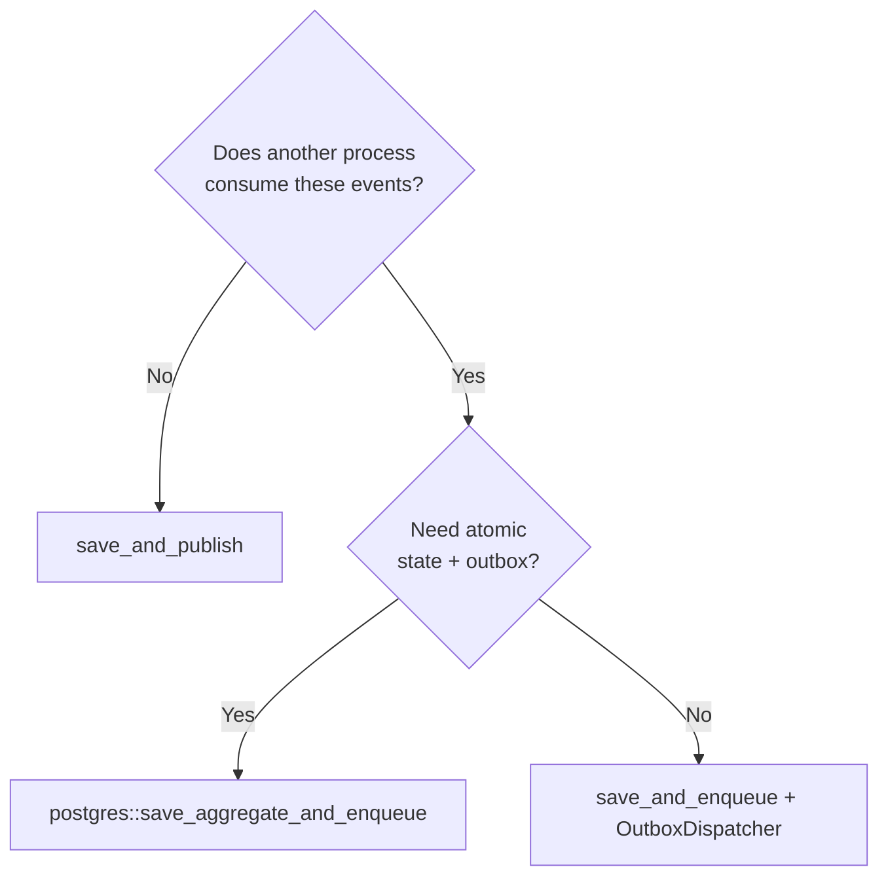

# Decision matrix: which path should I use?

Pharos is explicit by design: it offers more than one valid way to persist
state, deliver events, and expose handlers. This page removes the early
decision fatigue by giving you a default for each axis and the conditions under
which you should deviate.

If you only read one line: **start with the `starter` feature bundle
(PostgreSQL outbox + HTTP) and `save_and_publish`, then move to
`save_and_enqueue` the moment a second process needs your events.**

## Feature bundle

| You are…                                   | Use            | Why                                                       |
|--------------------------------------------|----------------|-----------------------------------------------------------|
| Building the common production service     | `starter`      | PostgreSQL + outbox + HTTP, no flag-by-flag choices.      |
| Exploring or in a multi-seam workspace     | `full`         | Everything compiled in; trim later.                       |
| Writing a pure domain/application crate    | default        | `macros` + `infra` only; no infrastructure pulled in.     |
| Adding one specific adapter                | the named flag | e.g. `redis`, `kafka`, `nats`, `es`, `saga`.              |

```toml
pharos = { version = "0.1", features = ["starter"] }
```

## Persistence

| Situation                                          | Adapter                                   |
|----------------------------------------------------|-------------------------------------------|
| Local dev, tests, prototypes                       | `pharos::infra::InMemoryRepository`       |
| Production, aggregate stored as a JSON document     | `pharos::postgres` JSON repository        |
| Production, normalized relational schema            | a hand-written `Repository` (see `examples/order`) |
| Multiple tenants sharing one database               | `pharos::postgres` `TenantJsonRepository` (row-level isolation) |

Default: the JSON repository. Reach for a normalized schema only when you need
relational queries, foreign keys, or reporting against the same tables.

## Event delivery

This is the choice that most often trips up first-time users.

| You need…                                                        | Use                  |
|------------------------------------------------------------------|----------------------|
| Every handler runs in **this** process, same transaction window  | `save_and_publish`   |
| Events must survive a crash and reach **another** process/service| `save_and_enqueue` + `OutboxDispatcher` |
| Atomic aggregate-state + outbox write in one DB transaction       | `pharos::postgres` `save_aggregate_and_enqueue` |

Rule of thumb: use `save_and_publish` until a second deployable unit needs the
events. Then switch to the outbox — never publish to a broker directly from a
command handler, or a crash between "commit" and "publish" silently loses
events.



## Broker / transport (when using the outbox)

| Constraint                                  | Adapter           |
|---------------------------------------------|-------------------|
| Simple queue, already running Redis          | `pharos::redis`   |
| Partitioned, high-throughput, replayable     | `pharos::kafka`   |
| Lightweight pub/sub, request-reply           | `pharos::nats`    |

## Consumer idempotency

If a consumer is not naturally idempotent, wrap it with an `InboxStore`
(`begin_processing` → handle → `mark_completed`/`mark_failed`). See the
[cookbook](cookbook.md) for the template. At-least-once brokers (Kafka, Redis,
NATS) will redeliver — assume every consumer sees duplicates.

## HTTP exposure

| You want…                                       | Use                                   |
|-------------------------------------------------|---------------------------------------|
| HTTP routes over command/query handlers          | `pharos::axum` (`run_command`, etc.)  |
| Framework-agnostic middleware/composition        | `tower` feature (`CommandHandlerService`) |
| No HTTP (worker, CLI, test)                       | call the handler directly             |

## See also

- [Cookbook](cookbook.md) — copy-paste templates for each path above.
- [Pitfalls](pitfalls.md) — the mistakes these defaults are designed to avoid.
- [Complete usage](complete-usage.md) — the end-to-end walkthrough.
