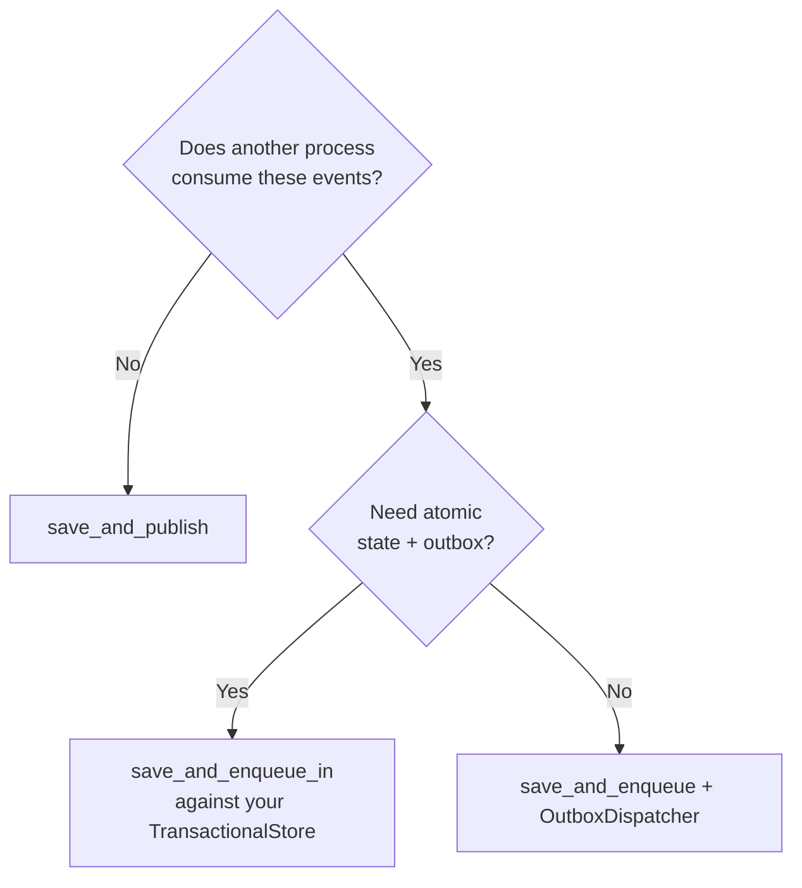

# Decision matrix: which path should I use?

Pharos is explicit by design: it offers more than one valid way to persist
state, deliver events, and expose handlers. This page removes the early
decision fatigue by giving you a default for each axis and the conditions
under which you should deviate.

If you only read one line: **start with `pharos-memory`'s in-process
adapters and `save_and_publish`, then bring your own storage (following
[Writing an adapter](writing-an-adapter.md)) and switch to
`save_and_enqueue`/`save_and_enqueue_in` the moment a second process needs
your events.**

## What ships vs. what you bring

Pharos RS ships no database, broker, or ORM dependency. The workspace has
two kinds of crates:

| You are…                                      | Depend on                                                                                                                                  |
| --------------------------------------------- | ------------------------------------------------------------------------------------------------------------------------------------------ |
| Modeling the domain / application layer       | `pharos-core`, `pharos-app` (+ `pharos-macros` via the `macros` feature)                                                                   |
| Testing or prototyping locally                | add `pharos-memory` — the only storage/broker adapter the workspace ships                                                                  |
| Exposing handlers over HTTP                   | add `pharos-axum`                                                                                                                          |
| Needing sagas or event sourcing               | add `pharos-saga` / `pharos-es`                                                                                                            |
| Going to production with real storage/brokers | implement the relevant trait yourself — see [Writing an adapter](writing-an-adapter.md) and [`reference-schema.sql`](reference-schema.sql) |

There is no `starter`/`postgres`/`redis`/`kafka`/`nats` feature bundle to
flip on: the `pharos` facade only gates `macros` (derives + `id_type!`) and
`serde` (for `Money`/`Currency`). Every other crate above is its own direct
dependency, not a facade feature — see [`crates.md`](crates.md) for the full
per-crate API surface.

```toml
pharos-core   = { path = "..." }
pharos-app    = { path = "...", features = ["tower"] }  # tower is optional
pharos-memory = { path = "..." }                          # local dev / tests
pharos-axum   = { path = "..." }                          # if exposing HTTP
```

## Persistence

| Situation                                       | Adapter                                                                                |
| ----------------------------------------------- | -------------------------------------------------------------------------------------- |
| Local dev, tests, prototypes                    | `pharos_memory::InMemoryRepository<A>`                                                 |
| Production, aggregate stored as a JSON document | your own `Repository<A>` over a JSONB-shaped table — see `reference-schema.sql`        |
| Production, normalized relational schema        | a hand-written `Repository<A>` (see `examples/order`)                                  |
| Multiple tenants sharing one database           | your own row-level-isolated `Repository<A>` — see `reference-schema.sql`'s RLS variant |

Whichever shape you pick, prove it correct against `pharos-testing`'s
`contract::repository` conformance suite instead of hand-testing OCC and
error mapping yourself — see [Writing an adapter](writing-an-adapter.md).

## Event delivery

This is the choice that most often trips up first-time users.

| You need…                                                            | Use                                                     |
| -------------------------------------------------------------------- | ------------------------------------------------------- |
| Every handler runs in **this** process, same transaction window      | `save_and_publish`                                      |
| Events must survive a crash and reach **another** process/service    | `save_and_enqueue_in` against your `TransactionalStore` |
| You can tolerate losing an event on a crash between save and enqueue | `save_and_enqueue` + `OutboxDispatcher`                 |

Rule of thumb: use `save_and_publish` until a second deployable unit needs the
events. Then switch to the outbox — never publish to a broker directly from a
command handler, or a crash between "commit" and "publish" silently loses
events.

`save_and_enqueue` (`pharos-app`) writes the aggregate and the outbox row as
**two separate statements**, not one transaction: if the process dies between
them, the event is lost for good. Only `save_and_enqueue_in`, composed
against your own `TransactionalStore` + `TransactionalRepository`
implementation, wraps both in a single transaction and is safe against that
crash window. The trait and the composing function are backend-agnostic —
they never name a concrete connection type — but *some* backend has to
implement `TransactionalStore` for the atomic path to exist; `pharos-memory`
ships `InMemoryUnitOfWork` for tests, and production needs your own (see
[Writing an adapter](writing-an-adapter.md)).


```mermaid
flowchart TD
    Q{Does another process<br/>consume these events?}
    Q -->|No| P[save_and_publish]
    Q -->|Yes| T{Need atomic<br/>state + outbox?}
    T -->|Yes| A[save_and_enqueue_in<br/>against your TransactionalStore]
    T -->|No| E[save_and_enqueue + OutboxDispatcher]
```

## Broker / transport (when using the outbox)

Pharos ships the traits (`MessagePublisher`, `MessageConsumer`,
`MessageAcknowledger`) and `pharos-memory`'s in-process broker for tests. For
production, implement the traits against whichever broker fits:

| Constraint                               | Typical choice                  |
| ---------------------------------------- | ------------------------------- |
| Simple queue, already running Redis      | a Redis adapter (lists/streams) |
| Partitioned, high-throughput, replayable | a Kafka adapter                 |
| Lightweight pub/sub, request-reply       | a NATS adapter                  |

All of these are your own adapter crate against the same three traits — see
[Writing an adapter](writing-an-adapter.md).

## Consumer idempotency

If a consumer is not naturally idempotent, wrap it with an `InboxStore`
(`begin_processing` → handle → `mark_completed`/`mark_failed`). See the
[cookbook](cookbook.md) for the template. At-least-once brokers (Kafka, Redis
streams, NATS JetStream) will redeliver — assume every consumer sees
duplicates.

## HTTP exposure

| You want…                                 | Use                                                       |
| ----------------------------------------- | --------------------------------------------------------- |
| HTTP routes over command/query handlers   | `pharos-axum` (`run_command`, etc.)                       |
| Framework-agnostic middleware/composition | `tower` feature on `pharos-app` (`CommandHandlerService`) |
| No HTTP (worker, CLI, test)               | call the handler directly                                 |

## Cross-layer error classification

| You want…                                                       | Use                                                                                                                      |
| --------------------------------------------------------------- | ------------------------------------------------------------------------------------------------------------------------ |
| An HTTP status + a safe public message from any layer's error   | implement `pharos_core::classify::ClassifiedError` on it, then `pharos_axum::status_for`/`HandlerError::from_classified` |
| To guarantee an adapter's raw error text never reaches a client | keep `public_message()` a fixed string for anything wrapping an untrusted/adapter error — never `self.to_string()`       |

`ClassifiedError` is optional to adopt but is how the framework itself
avoids leaking storage/broker details across the domain → application →
transport boundary — see [`pharos-core`](crates.md#pharos-core) in the crate
reference.

## Serialization format

| Situation                                                      | Format                       |
| -------------------------------------------------------------- | ---------------------------- |
| Development, debugging, human-readable logs                    | `JsonEventSerializer`        |
| Kafka pipelines, strict schema contracts, bandwidth-sensitive  | `ProtobufEventSerializer`    |
| Schemaless cache values, broker messages with dynamic payloads | roll your own `MessageCodec` |

Both serializers implement `MessageCodec<P>` — a unified trait that lets you
write format-agnostic infrastructure code:

```rust
fn enqueue<P, C: MessageCodec<P>>(codec: &C, event: &IntegrationEvent<P>) -> SerializedEvent {
    codec.encode(event).expect("encoding should not fail")
}

enqueue(&JsonEventSerializer, &json_event);       // works
enqueue(&ProtobufEventSerializer, &proto_event);  // also works
```

The two serializers differ only in the payload bounds required by each `impl`:

| Serializer                | Payload bound (`impl`)                   | Crate          |
| ------------------------- | ---------------------------------------- | -------------- |
| `JsonEventSerializer`     | `Serialize + DeserializeOwned + 'static` | `pharos-app`   |
| `ProtobufEventSerializer` | `prost::Message + Default + 'static`     | `pharos-proto` |

Consumers inspect `SerializedEvent::content_type` (`"application/json"` vs
`"application/x-protobuf"`) to choose the correct deserializer without
out-of-band signalling.

## See also

- [Cookbook](cookbook.md) — copy-paste templates for each path above.
- [Pitfalls](pitfalls.md) — the mistakes these defaults are designed to avoid.
- [Complete usage](complete-usage.md) — the end-to-end walkthrough.
- [Writing an adapter](writing-an-adapter.md) — bringing your own storage/broker.
